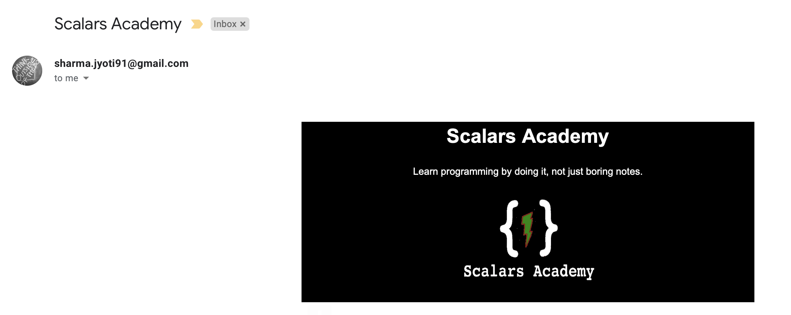

# Sending-HTML-Email-Using-Python

## Description

This program reads the E-Mail IDs from the XLSX file (email-id-sheet) and send the html template (scalars.html) to the all emails ids mention in the sheet.

## Key Features
1. Read Email IDs from .xlsx file.
2. Load html file as jinja2 template.
2. Sending that html template using python.

## Screenshot of html mail
 
